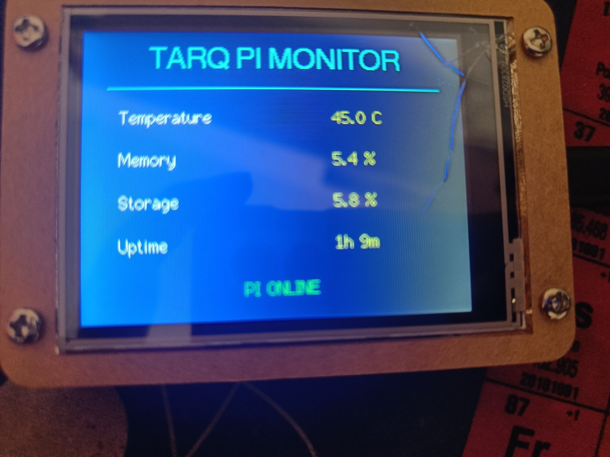
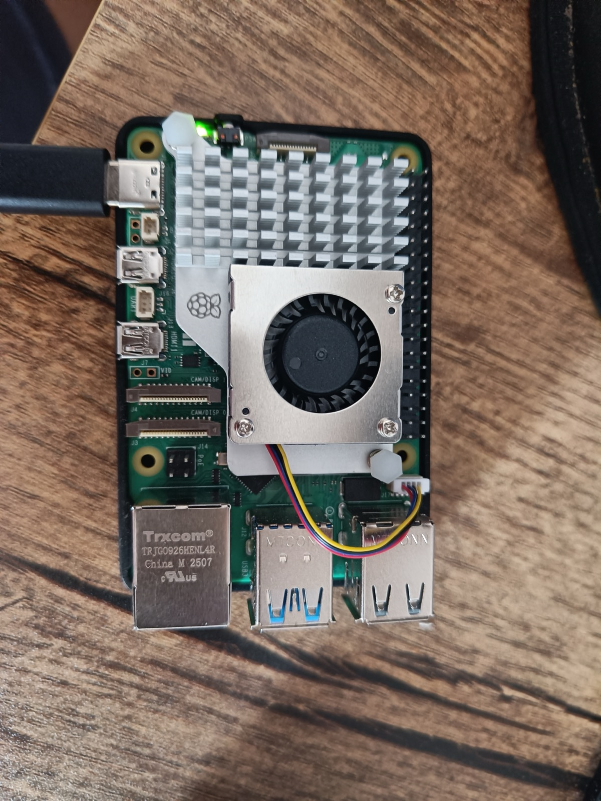

# TARQ Pi Monitor

This is my first project connecting a Raspberry Pi and an ESP32 over Wi-Fi. I
started by learning how to flash an ESP32 touchscreen and read raw touch pressure.
Then I set up a Raspberry Pi 5 from scratch and turned the display into a live
system monitor for it.

The screen now updates every five seconds and shows the Pi's temperature, memory
use, storage use, uptime, and online status.



## What I used

- Raspberry Pi 5 with 8 GB RAM
- Official Raspberry Pi Active Cooler
- Official USB-C power supply
- Protective bumper
- 128 GB SanDisk microSD card
- ELEGOO ESP32-32E 2.8-inch display
- Mac Studio
- PlatformIO and VS Code
- Raspberry Pi OS 64-bit

## The build flow

### 1. I learned the ESP32 touchscreen first

I connected the ELEGOO display to my Mac, backed up its factory firmware, and
created a PlatformIO project. My first program drew text and colours. The next
program read raw X, Y, and pressure values from the resistive touchscreen.

That pressure diagnostic is preserved in the repository's Git history. It helped
me understand that the display and touch panel use separate controller chips and
that raw sensor readings are not the same as calibrated screen pixels.

### 2. I assembled and booted the Raspberry Pi

I installed the official Active Cooler on the Pi 5, connected its fan cable,
fitted the bumper, and inserted the microSD card. I used Raspberry Pi Imager on
the Mac to install Raspberry Pi OS and preconfigured:



- Hostname: `tarq-pi`
- Wi-Fi
- User account
- SSH access
- India/Asia-Kolkata localisation

The Pi initially ran without its own monitor, keyboard, or mouse. This is called
a **headless** setup.

### 3. I controlled the Pi from my Mac using SSH

From Mac Terminal, I connected with:

```bash
ssh om@tarq-pi.local
```

SSH gives me an encrypted terminal session on the Pi over Wi-Fi. When the prompt
changes to `om@tarq-pi`, commands are running on the Raspberry Pi rather than on
the Mac.

I checked the hardware with:

```bash
free -h
df -h /
vcgencmd measure_temp
vcgencmd get_throttled
```

The Pi reported 7.9 GiB RAM, about 117 GiB usable storage, a normal temperature,
and `throttled=0x0`, meaning no power or thermal warning was recorded.

### 4. I made the Pi serve its measurements

The Python program in [`pi-server/server.py`](pi-server/server.py) reads Linux
system information and publishes it as JSON at:

```text
http://tarq-pi.local:8000/status
```

Example response:

```json
{
  "hostname": "tarq-pi",
  "temperature_c": 45.5,
  "memory_percent": 5.5,
  "disk_percent": 5.8,
  "uptime_seconds": 2045
}
```

I tested it from the Mac with:

```bash
curl http://tarq-pi.local:8000/status
```

I then installed it as a systemd service, so it starts when the Pi boots and
restarts if it crashes.

### 5. I connected the ESP32 to the Pi

The ESP32 joins the same Wi-Fi network, requests the JSON endpoint every five
seconds, extracts the measurements, and redraws the TFT display. The two boards
do not need a physical data cable between them.

```text
Raspberry Pi 5                          ESP32 display
--------------                         -------------
Reads Linux statistics                 Connects to Wi-Fi
Runs Python HTTP server   --Wi-Fi-->   Sends HTTP GET /status
Returns JSON                            Parses JSON
                                       Draws live values
```

## How the Pi server code works

[`pi-server/server.py`](pi-server/server.py) uses only Python's standard library:

- `subprocess.run(["vcgencmd", "measure_temp"])` asks Raspberry Pi firmware for
  the processor temperature.
- `/proc/meminfo` is a Linux file containing current memory measurements. The
  program calculates used memory from total minus available memory.
- `shutil.disk_usage("/")` measures the main microSD filesystem.
- `/proc/uptime` contains the number of seconds since Linux booted.
- `get_status()` combines those readings into a Python dictionary.
- `json.dumps()` converts the dictionary into JSON.
- `ThreadingHTTPServer(("0.0.0.0", 8000), ...)` listens on port 8000 and can
  handle network requests.
- `StatusHandler` returns the JSON for `/` and `/status`, and returns 404 for
  unknown paths.

The service definition in
[`pi-server/tarq-dashboard.service`](pi-server/tarq-dashboard.service) tells
systemd which user, folder, and Python command to run. `Restart=on-failure` asks
Linux to restart the server after a crash.

## How the ESP32 code works

[`src/main.cpp`](src/main.cpp) contains the display firmware:

- `WiFi.h` connects the ESP32 to my router as a station.
- `HTTPClient.h` makes the request to the Pi.
- `ArduinoJson.h` converts the JSON response into usable values.
- `TFT_eSPI.h` draws the heading, measurements, status messages, and colours.
- `connectToWiFi()` attempts to connect for up to 20 seconds and reports success
  or failure on the screen and serial monitor.
- `requestStatus()` checks Wi-Fi, performs an HTTP GET, validates the HTTP result,
  parses JSON, and handles network or data errors.
- `drawStatus()` formats temperature, percentages, and uptime for the display.
- `millis()` schedules a refresh every five seconds without resetting the ESP32.

The URL is currently:

```cpp
constexpr char STATUS_URL[] = "http://tarq-pi.local:8000/status";
```

Both devices must be on the same network, and that network must support `.local`
hostname discovery.

## Wi-Fi credentials

Real credentials are never stored in Git. Copy the example file:

```bash
cp include/secrets.example.h include/secrets.h
```

Then edit `include/secrets.h`:

```cpp
#pragma once

constexpr char WIFI_NAME[] = "YOUR_WIFI_NAME";
constexpr char WIFI_PASSWORD[] = "YOUR_WIFI_PASSWORD";
```

`include/secrets.h` is ignored by Git. Do not remove that ignore rule.

## Build the ESP32 firmware

1. Install VS Code and PlatformIO.
2. Open this repository.
3. Create `include/secrets.h` as described above.
4. Connect the ELEGOO ESP32 display over USB.
5. Run **Build**, then **Upload**.
6. If upload stalls at `Connecting...`, hold **BOOT**, tap **RESET**, and release
   **BOOT** when writing starts.

The display should show `PI ONLINE` and update approximately every five seconds.

## Install the Pi service

Copy `pi-server` to `/home/om/tarq-dashboard/pi-server` on the Pi. Then install
the service:

```bash
sudo cp pi-server/tarq-dashboard.service /etc/systemd/system/
sudo systemctl daemon-reload
sudo systemctl enable --now tarq-dashboard
systemctl status tarq-dashboard --no-pager
```

Useful commands:

```bash
sudo systemctl restart tarq-dashboard
journalctl -u tarq-dashboard -n 30 --no-pager
curl http://tarq-pi.local:8000/status
```

## Current result

The complete chain works:

```text
Pi sensors -> Python -> HTTP/JSON -> Wi-Fi -> ESP32 -> TFT display
```

This project taught me how to assemble and verify a Pi, install Linux, use SSH,
run a background service, expose a small API, connect an ESP32 to Wi-Fi, parse
JSON, and turn data from one computer into a live display on another.


##Whats next

Planning to use the actual breadboard, and get my hands dirty with some wires and circuit making.
